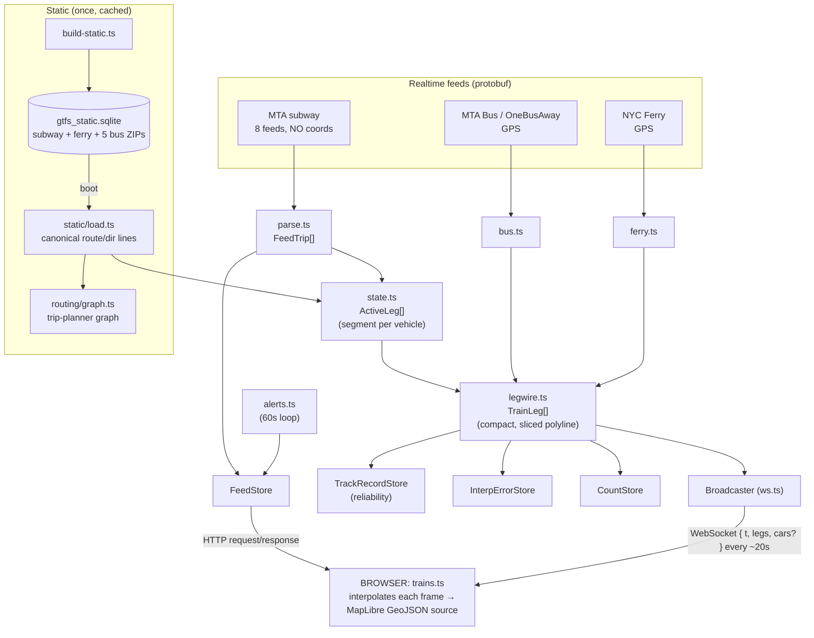
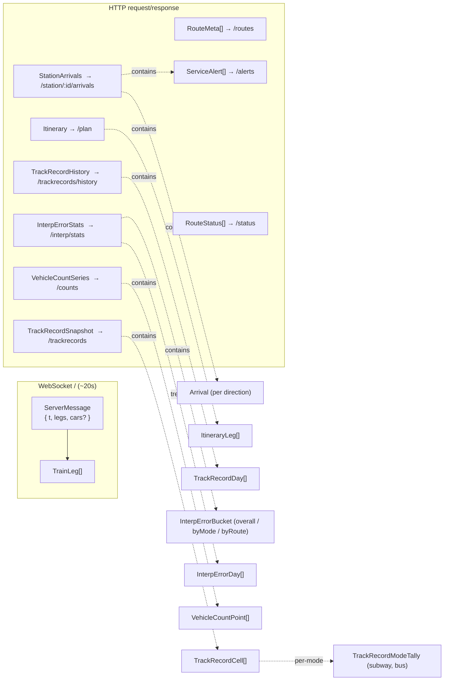

# TransitPlotter — Maintenance Guide

A human-oriented companion to the `README.md`. The README explains **what** the
system does and where the data comes from; this document explains **how it hangs
together**, how to keep it running, what tends to break, where the tunable knobs
are, and what still needs work. Read the README first if you haven't.

> Audience: whoever has to fix this at 2am when the map goes blank. That might be
> future-you. Be kind to them by keeping this file up to date when you change
> something structural.

---

## Table of contents

1. [Mental model in 60 seconds](#1-mental-model-in-60-seconds)
2. [The monorepo and how it runs](#2-the-monorepo-and-how-it-runs)
3. [Data flow, end to end](#3-data-flow-end-to-end)
4. [Module reference — server](#4-module-reference--server)
5. [Module reference — web](#5-module-reference--web)
6. [The shared wire contract](#6-the-shared-wire-contract)
6.5 [The motion model (interpolation)](#65-the-motion-model-interpolation)
7. [Interfaces between modules](#7-interfaces-between-modules)
8. [Tunable parameters (the knobs)](#8-tunable-parameters-the-knobs)
9. [Common bugs and how to address them](#9-common-bugs-and-how-to-address-them)
10. [Things likely to break in the future](#10-things-likely-to-break-in-the-future)
11. [Open areas of development / needed improvement](#11-open-areas-of-development--needed-improvement)
12. [Operational runbook](#12-operational-runbook)

---

## 1. Mental model in 60 seconds

The core insight of the whole project: **the MTA subway realtime feed does not
contain train coordinates.** It only tells you, per active trip, the *predicted
arrival/departure times at upcoming stops*. So we cannot just plot dots.

Instead:

- The **server** knows the real track geometry (from static GTFS "shapes"). For
  each train it figures out *which segment it's on* (previous stop → next stop),
  slices the real curved polyline for that segment, and ships that little
  polyline plus the two schedule times (`d0` depart, `d1` arrive) to the browser.
- The **browser** does the animation. It moves each train along its polyline
  using a **trapezoidal speed profile** (accelerate out of a stop, cruise,
  decelerate in, dwell) and an **along-track follower** that carries position
  across refreshes so it never teleports. (See §3.5 — this replaced the old
  naive `progress = (now - d0)/(d1 - d0)` constant-speed model, which caused the
  whole fleet to jolt on every feed refresh.) That's why motion looks smooth even
  though the server only speaks every ~20 seconds.

Buses and ferries are easier: their feeds **do** include GPS, so the server just
snaps them to their shape and sends a short leg toward the next stop.

Everything else (arrivals boards, alerts, trip planner, reliability history,
visitor analytics) is bolted onto the same server process and the same
single-page app.

---

## 2. The monorepo and how it runs

Three npm workspaces:

| Workspace | Package name              | Role                                     |
| --------- | ------------------------- | ---------------------------------------- |
| `shared/` | `@transitplotter/shared`  | Pure TypeScript types (the wire contract). No runtime code. |
| `server/` | `@transitplotter/server`  | Node backend. Polls feeds, serves HTTP + WebSocket. |
| `web/`    | `@transitplotter/web`     | Vite + MapLibre single-page app.         |

Key facts that surprise people:

- **There is no build step for `shared` or `server`.** They run through `tsx`
  directly (TypeScript executed at runtime). `server/tsconfig.json` mentions a
  `dist` outDir but nothing invokes `tsc`. Only `web` is compiled, by Vite.
- **`shared` is imported as raw `.ts`.** The workspace resolves
  `@transitplotter/shared` straight to `shared/src/types.ts`. No compilation, no
  `.d.ts` shipping. This is why both sides always agree on types with zero
  ceremony — but also why a syntax error in `types.ts` breaks both at once.
- **Everything runs in Docker.** Nothing is installed on the host. One
  `Dockerfile` (node:22-bookworm-slim) builds a single image used by all three
  compose services. `python3/make/g++` are installed *only* because
  `better-sqlite3` compiles a native addon.

Compose services (`docker-compose.yml`):

- **`server`** — `npm run dev:server` (= `tsx watch`), host `8090` → container
  `8080`. Restart policy `unless-stopped`.
- **`web`** — `npm run dev:web` (= Vite dev server), `5173:5173`.
- **`build-static`** — one-shot, behind the `tools` profile. Downloads and
  ingests the static GTFS into the cache SQLite.

The static SQLite, `track_records.json`, and `visits.json` all live in a
**bind-mounted cache directory** (`GTFS_CACHE_HOST` on the host →
`/cache` in the container). None of it is in the repo.

> ⚠️ Both compose commands run **dev** servers (`tsx watch`, Vite dev). There is
> no production build/serve path defined. See §10.

---

## 3. Data flow, end to end



The two server timers that drive everything live in **`tick.ts`**:

- `poll()` every **20s**: fetch subway + ferry + bus + traffic in parallel
  (tolerating per-mode failure), build `TrainLeg[]`, feed the track-record /
  interp-error / count tallies, broadcast the `ServerMessage`.
- `pollAlerts()` every **60s**: fetch + classify service alerts into `FeedStore`.
- Flush timers (**60s**) persist `TrackRecordStore`, `InterpErrorStore`, and
  `CountStore` to JSON; `refreshCalibration()` re-derives the traffic α **daily**.

---

## 4. Module reference — server

Files are under `server/src/`. Line counts are approximate and drift; treat them
as "small / medium / large."

### Entry & orchestration

- **`index.ts`** — Entry point. `startServer(port)` loads the static DB, builds
  the routing graph, constructs `FeedStore`, `TrackRecordStore`, `VisitStore`,
  `Broadcaster`, starts the poll loops, and wires SIGTERM/SIGINT to flush the
  persistent stores. Self-invokes when run directly.
- **`tick.ts`** — The heartbeat. Owns the `poll()` / `pollAlerts()` /
  track-flush intervals. This is the file to read to understand the runtime loop.
- **`feeds.ts`** — All feed URLs and the two poll intervals
  (`POLL_INTERVAL_MS`, `ALERTS_POLL_INTERVAL_MS`). Bus URLs are built from
  `BUS_API_KEY`.

### Realtime ingestion (feed → vehicles)

- **`parse.ts`** — Fetches and protobuf-decodes the 8 subway feeds in parallel
  with `Promise.allSettled`, flattening each active trip into a `FeedTrip`
  (tripId, routeId, header timestamp, ordered stop-time predictions).
- **`feedstore.ts`** — Dead-simple in-memory holder for "the latest parsed feed"
  and "the latest alerts." Writer = poll loop; readers = HTTP handlers
  (arrivals, alerts, status). **Not persisted** — this is ephemeral realtime.
- **`state.ts`** — The brain of subway positioning. Merges `FeedTrip[]` with the
  static canonical lines to produce `ActiveLeg[]`: finds each train's current
  segment, looks up shape distances, normalizes express suffixes and route
  aliases (e.g. **W borrows N's geometry**). Defines the `ActiveLeg` interface
  that ferry and bus also emit.
- **`ferry.ts`** — NYC Ferry realtime (Connexionz) → `ActiveLeg[]`. Uses real
  GPS, projects the boat onto its trip shape toward the next landing. Ids
  prefixed `F:`, `mode:"ferry"`, carries speed + vessel id.
- **`bus.ts`** — MTA Bus (OneBusAway) realtime → `ActiveLeg[]`. Real GPS,
  straight-line hop to next stop (no street geometry). `busBorough()` maps route
  prefixes to borough codes. Ids prefixed `B:`, `mode:"bus"`. Schedule deviation
  comes from **`tripUpdate.delay`** (trip level) — the per-`stopTimeUpdate`
  `arrival/departure.delay` is never populated on this feed and decodes to the
  protobuf default `0` (see §9, "Track records report 0% late everywhere").
- **`traffic.ts`** — Estimated car count (not `ActiveLeg`s — a scalar per poll).
  Keyless NYC DOT Traffic Speeds → Greenshields density → citywide estimate,
  calibrated to MTA CRZ entries. See the store description above and §6.6.
- **`legwire.ts`** — Converts `ActiveLeg[]` → the compact `TrainLeg[]` wire
  format: slices the shape polyline to the active segment, **clamps implausible
  speeds** (`MAX_SPEED_MPS`), computes delay (feed-reported for buses, else
  measured against the median typical segment time), rounds coordinates to ~1m
  to shrink the payload.

### Read-side services (HTTP)

- **`alerts.ts`** — Fetches/decodes the all-agency alerts protobuf, filters to
  subway + currently-active. `classify()` derives severity from **headline
  text** (the feed always reports `effect = UNKNOWN`). `rollUpStatus()` produces
  per-route worst-severity `RouteStatus[]`.
- **`arrivals.ts`** — Builds a per-station arrivals board from the latest feed in
  `FeedStore`: scans for upcoming stops at the station, groups N/S, computes
  seconds-to-arrival, attaches relevant alerts.
- **`ws.ts`** — The big one. `Broadcaster` creates the `http.Server` +
  `WebSocketServer`, precomputes routes/stations GeoJSON, and owns **all HTTP
  routing**: `/plan`, `/routes`, `/geo/routes`, `/geo/stations`, `/visit`,
  `/admin/login`, `/admin/stats`, `/admin/health`, `/trackrecords`,
  `/trackrecords/history`, `/interp/stats`, `/counts`, `/alerts`, `/status`,
  `/station/<id>/arrivals`, `/health`, `/`. Admin auth via `ADMIN_PASSWORD`
  (default `"CONFIG"`). If you add an endpoint, it goes here.

### Persistent stores (the only things written to disk at runtime)

- **`trackrecord.ts`** — `TrackRecordStore`. Reliability history bucketed into a
  ~445m spatial mesh (`LAT_STEP`/`LON_STEP`). Records one observation per
  completed segment traversal per trip (subway + bus; ferries excluded). Cells
  become "ready" (colored on the map) after a **1-day observation span**
  (`WINDOW_DAYS`) and enough decayed weight (`MIN_READY_WEIGHT`). **Storage is
  bounded — it does NOT grow with the number of observations:** each cell keeps
  a *time-decayed* late/total tally per mode (an exponential moving average with
  `DECAY_HALFLIFE_MS`, default 1 day). On each new observation the existing
  counts are first multiplied by `0.5^(dt/halflife)` then the new sample (weight
  1) is added, so old data fades and the numbers converge instead of summing
  forever. The percentage therefore tracks *recent* reliability and keeps
  updating over time. A short per-cell daily series (pruned to
  `MAX_HISTORY_DAYS`) still backs the click-through trend plot. Persists a
  compact JSON tally keyed by cell — O(cells), not O(observations).
- **`visits.ts`** — `VisitStore`. Visitor analytics: total, per-day, unique
  public IPs geolocated once via ip-api.com. `isPrivateIp()` filters LAN;
  `clientIp()` honors `X-Forwarded-For` (assumes a trusted reverse proxy).
  Persists `visits.json`.
- **`interp.ts`** — `InterpErrorStore`. Interpolation-error metrics (see §6.5).
  Each refresh, compares the previous leg's predicted position against ground
  truth (GPS for bus/ferry; snap magnitude for subway). Reservoir-sampled
  mean/p50/p95 overall / per-mode / per-route + per-day trend. Persists
  `interp_errors.json`. Served at `/interp/stats`.
- **`counts.ts`** — `CountStore`. Records one sample per poll (see `tick.ts`) of
  active + delayed (predicted delay ≥ 120s) vehicle counts per mode
  (subway/bus/ferry) plus the estimated `cars` on NYC roads, kept in a rolling
  48h window and persisted to `counts.json`. Served at `/counts`; drives the two
  HUD double-click charts (`web/src/counts-modal.ts`). Newer fields
  (`*Delayed`, `cars`) default to 0 for points persisted before they existed.
- **`traffic.ts`** — Estimated cars on NYC roads (there is no live "cars in NYC"
  feed, so this is a synthesized, labeled estimate). Per poll, fetches the live
  **NYC DOT Traffic Speeds** links (direct TMC tab-separated snapshot, SODA JSON
  fallback), computes a Greenshields density `k = kjam·(1 − v/vfree)` per link →
  cars ≈ `k · length_km · lanes`, sums the monitored network, and scales by a
  factor **α**. α is calibrated daily from the **MTA Congestion Relief Zone**
  entries (weekly data): true CBD cars-present ≈ `entries/hr · dwell` (Little's
  law) is matched against the CBD Greenshields sum. All constants live in
  `feeds.ts` and are documented estimates. Tolerant of feed failure (skips the
  poll / keeps last α). Note the TMC feed occasionally truncates `link_points`
  mid-coordinate, so points are clamped to an NYC bounding box before length
  math.

### Trip planner

- **`routing/graph.ts`** — At boot, builds the planner graph from the static
  schedule: median in-vehicle RIDE edges per consecutive stop-pair + TRANSFER
  edges between distinct stations ≤ `TRANSFER_MAX_M` apart. Also stores the
  `typical` segment times used by `legwire` for delay estimation.
- **`routing/plan.ts`** — `planJourney()`: snaps origin/destination to nearest
  stations, runs **Dijkstra over `(station, routeAboard)` states** with a
  per-transfer penalty, assembles an `Itinerary`.
- **`routing/geocode.ts`** — Forward-geocodes free text → coordinate via
  configurable Nominatim (`GEOCODER_URL`), biased to an NYC viewbox. Accepts a
  literal `lat,lon` directly.

### Static data loading

- **`static/load.ts`** — Loads the static SQLite into memory: routes, stops,
  trips, shapes (with cumulative distances), stop_times. Builds
  `shapesByRouteDir` and the canonical `lineByRouteDir` (longest shape per
  route+dir with every stop projected onto it). Parses the dotted shape-id
  encoding (`5..N08R`, `GS.N01R`, `SI..S03R`).
- **`static/geometry.ts`** — Pure helpers: `bearing()`, `projectDistance()`
  (nearest-point projection onto a polyline, planar approximation),
  `pointAtDistance()` (binary search + interpolate along cumulative distances).

### Tooling

- **`scripts/build-static.ts`** — Downloads three GTFS static sources into one
  SQLite: MTA supplemented ZIP (subway, no prefix), NYC Ferry ZIP (`F:`), and 5
  MTA Bus borough ZIPs (`B:`, routes/stops/trips only — no shapes/stop_times to
  keep the DB small). Skips if the DB exists unless `FORCE=1`.

---

## 5. Module reference — web

Files under `web/src/`. **All CSS and the DOM scaffold live in
`web/index.html`** (~500 lines of inline CSS) — there are no separate `.css`
files. If a control looks wrong, the style is in `index.html`, not in a `.ts`.
The **mobile layout** also lives there: rules keyed off `html.tp-mobile-on`
collapse the control stack into a slide-in panel behind the `#menu-fab` ☰
button, shrink the HUD to a status chip, and hide the legend. Those rules are
duplicated once under `@media (max-width:640px),(pointer:coarse)` (auto-detected
devices) and once under the `tp-mobile-on` class (added by `config.ts` for
forced-mobile) because CSS can't OR a media query with a class in one block.

- **`main.ts`** — Bootstrap and wiring. Creates the map, fetches `/routes`, adds
  layers, then constructs/attaches every UI piece: legend, train popups, station
  panel, alerts UI, trip planner, hotspots, track records, ferries toggle,
  per-borough bus controls, **view-mode toggle**, **mobile menu**, hidden admin.
  Opens the WebSocket, renders the HUD, fires the `/visit` beacon. This is the
  "what talks to what" file for the frontend. `setupMobileMenu()` wires the ☰
  button that slides the controls panel in/out on mobile (toggles `tp-menu-open`
  on `<html>`); tapping a top-level control auto-closes it (bus-borough toggles
  are exempt so several can be flipped in a row), as does tapping the map.
- **`config.ts`** — Two responsibilities:
  1. **Backend host resolution.** LAN/http → `host:8090`; HTTPS → same-origin
     `/api` + `/ws` (assumes a Caddy proxy). Overridable via Vite env
     (`VITE_SERVER_HTTP` / `VITE_SERVER_WS`).
  2. **View mode** (`auto` / `mobile` / `desktop`) — the single source of truth
     for `IS_MOBILE`, persisted in `localStorage["tp-view"]`, with
     `cycleViewMode()` (reloads to re-apply). Tags `<html>` with
     `tp-force-mobile` / `tp-force-desktop` (explicit override) **and
     `tp-mobile-on`** (the effective-mobile flag the mobile stylesheet keys
     off), so CSS can force/declutter the layout.
- **`basemap.ts`** — Builds the MapLibre map (Esri World Imagery satellite,
  3D pitch on desktop / flat on mobile, `pixelRatio` capped on mobile) and every
  layer: routes, ferry routes, disrupted overlay, station dots/pins (canvas
  teardrop icons), bus stops, hotspots heatmap, track-records fill/outline,
  train bullets, stalled halo, buses, ferries. Also a **street-labels** raster
  overlay (Esri World Transportation tiles) faded in at block-level zoom
  (`STREET_LABEL_MINZOOM`, default 14) so streets are named when zoomed in
  without cluttering the city-wide view. Exports the visibility/filter setters
  (`setFerriesVisible`, `setBusBoroughs`, `setBusMinZoom`, `setHotspotsVisible`,
  `setTrackRecordsVisible`, `setDisruptedRoutes`) and `emptyFC()`.
- **`trains.ts`** — `TrainLayer`, the client-side position engine. Ingests leg
  batches, interpolates each vehicle along its polyline by time fraction every
  frame (FPS-capped: 12 mobile / 30 desktop), **eases position transitions
  between feed refreshes** (the anti-jolt smoothing), derives status, animates
  the stalled halo, feeds the hotspots heatmap. Exposes `delayedNear()` and the
  `LiveTrain` snapshot used by hotspot summaries.
- **`bullets.ts`** — Canvas icon renderers: circular route bullets (diamonds for
  express), rounded-square ferry badges, rounded-pill bus badges.
  `registerAllBullets()` dispatches by id prefix.
- **`ui.ts`** — Line legend + click-a-vehicle popup (ferries get an expanded
  telemetry block: speed, heading, GPS, vessel id). Wires click/hover on the
  train/ferry/bus layers.
- **`station.ts`** — `StationPanel`: fetches `/station/:id/arrivals`, renders
  per-direction countdowns + bullets + alerts, auto-refreshes every 15s while
  open.
- **`alerts.ts`** — `AlertsUI`: polls `/status` + `/alerts` (60s), renders the
  top line-status strip and the alerts drawer, and reports disrupted routes
  (severity ≥ 2) back to the map via a callback.
- **`planner.ts`** — `TripPlanner`: From/To inputs → `GET /plan` → itinerary
  panel + highlighted route line (fits bounds). Caches station coords from
  `/geo/stations`.
- **`hotspot.ts`** — `attachHotspotSummary`: when hotspots are on, a map click
  gathers delayed/stalled trains within `CLICK_RADIUS_M` (900m) and shows a
  summary popup.
- **`trackrecords.ts`** — `TrackRecords` client: polls `/trackrecords` (30s),
  builds mesh-cell GeoJSON, exposes `isReady()`, `snapshot()`, `cellAt()`.
- **`trackrecord-summary.ts`** — Click-a-cell rationale popup with a lazily
  loaded inline SVG "% late by day" chart from `/trackrecords/history`.
- **`admin.ts`** — Hidden admin overlay (quadruple-click the map). Password
  login → `/admin/stats` → visit totals, daily bar chart, world-map SVG of
  visitor geo-clusters (uses `public/assets/world.svg`).
- **`isolate.ts`** — `setupIsolate`: the "Isolate" control opens a scrollable
  picker of subway lines + ferry routes (buses/cars excluded). Selecting one
  calls `setIsolatedRoute()` in `basemap.ts` to filter the route line, its
  stations, and the vehicle layers down to that id, fits the view to the line,
  and shows a corner stats box: vehicle count, split by direction (destination
  headsign), and any delays — refreshed every 2s from `TrainLayer.trainsOnRoute()`.
  Exit restores the saved layer filters via `clearIsolate()`. Station membership
  is a substring match on the concatenated `routes` prop (e.g. "ACE"); express
  suffixes ("6X") map to the base line's stations.
- **`counts-modal.ts`** — `setupCountsModal`: double-click / double-tap the Live
  HUD to open a modal with **three** stacked 48-hour line charts: active
  vehicles, delayed (≥ 2 min), and severely delayed (≥ 10 min). The **active**
  chart plots subway/bus/ferry on the left axis and estimated **cars** on a
  **right-hand Y axis** (their own scale, since cars are ~1000× the transit
  counts); the "Cars (est.)" control toggles that series (and the HUD 🚗 line)
  on/off via `carsShown()` in `main.ts`. The two **delay** charts share one
  `bindDelayChart(tier, suffix)` implementation, differing only by a `DelayTier`
  accessor (`TIER_DELAYED` reads `*Delayed`/`busDelayedBoro`; `TIER_VERY_DELAYED`
  reads `*VeryDelayed`/`busVeryDelayedBoro`). Each keeps subway + ferry on the
  left axis and splits its **buses by borough** (5 lines) onto the **right-hand
  Y axis** — delayed buses run ~1–2 orders of magnitude higher, so a shared axis
  would flatten subway/ferry. Each delay chart has its **own** "Bus lateness:
  Count / % of active" toggle (independent per chart) that renormalizes the bus
  lines to `busXDelayedBoro / busActiveBoro` on a fixed 0–100 % right axis.
  Fetches a static snapshot from `/counts` on open; renders inline SVG via a
  shared `plotSvg` (left/right axis chosen per series; right axis can be pinned
  via `rightMax` for the % scale). X axis is a fixed 48h window; the pre-data gap
  is shaded "no data".

---

## 6. The shared wire contract

`shared/src/types.ts` is the **only** place both sides agree on. No runtime code
— pure `interface`/`type` declarations. Every field carries a doc comment in the
source; this section is the map of *which type is served where* and the gotchas.

### 6.1 Where each type travels



### 6.2 The WebSocket payload (the one high-frequency type)

- **`ServerMessage`** = `{ t: number; legs: TrainLeg[]; cars?: number }`.
  `t` is server epoch-ms when the batch was built; `cars` is the synthesized
  NYC road-car estimate (absent if the traffic feed failed that poll).
- **`TrainLeg`** — one vehicle's *current leg*. Field names are deliberately
  **short** to shrink the ~1000-vehicle broadcast:

  | Field  | Type | Meaning |
  | ------ | ---- | ------- |
  | `id`   | string | GTFS-realtime trip id (namespaced `F:`/`B:` for ferry/bus) |
  | `r`    | string | Route id, for coloring (e.g. `1`, `A`, `L`) |
  | `path` | `[lng,lat][]` | Segment polyline in travel order (curved track slice, or two stop coords as fallback) |
  | `d0`   | epoch s | Departure from previous stop |
  | `d1`   | epoch s | Predicted arrival at next stop |
  | `hts`  | epoch s | Feed header timestamp (drives stall detection) |
  | `ns?`  | string | Next stop name |
  | `dest?`| string | Trip's final destination name |
  | `dly?` | seconds | Estimated delay vs. typical segment time; `0`/absent = on time. **Buses source this from `tripUpdate.delay`** (see §9) |
  | `mode?`| enum | `"ferry"` \| `"bus"`; **absent = subway** |
  | `label?`| string | Vessel label (ferry) or route pill (bus) |
  | `boro?`| string | Borough code for bus client-side toggling |
  | `spd?` | m/s | Momentary speed (ferries/buses, when the feed reports it) |
  | `vid?` | string | Vehicle/vessel id (e.g. ferry hull id) |

  Note the **absent-means-subway** convention on `mode`: it saves a field on the
  ~380 subway legs that dominate the frame. Consumers must default it.

### 6.3 Request/response types (HTTP)

- **`RouteMeta`** `{ id, color, name }` → `/routes`, once on load for legend/colors.
- **`Arrival`** `{ route, color, express, eta, inSec, dest }` — a single upcoming
  train at a station. **`StationArrivals`** `{ id, name, north[], south[], alerts? }`
  groups them by direction → `/station/:id/arrivals`.
- **`ServiceAlert`** `{ id, routes[], stops[], header, description, severity, effect }`.
  `severity` is `1|2|3` (info/planned → delays → suspended), derived from
  headline text (§9). → `/alerts`, and embedded in `StationArrivals.alerts`.
- **`RouteStatus`** `{ route, color, severity, label }` — per-route worst
  severity for the top strip → `/status`. Note `severity` here is `0|1|2|3`
  (`0` = good service), one wider than `ServiceAlert`.
- **`ItineraryLeg`** (`kind: "ride"|"walk"`, route/color, from/to id+name,
  `stops[]`, `numStops`, `seconds`) and **`Itinerary`** (`seconds`, `transfers`,
  `legs[]`, resolved `origin`/`destination`) → `/plan`.

### 6.4 Persisted-history types (HTTP)

- **Track records** (`/trackrecords`, `/trackrecords/history`):
  - `TrackRecordModeTally` `{ late, total }` — per mode, per cell.
  - `TrackRecordCell` `{ key, lat, lon, rate, total, ready, firstObs, lastObs,
    subway, bus }` — one spatial mesh cell. `rate` is the **average of the
    per-mode late percentages** (subway and bus weighted equally, only modes
    with observations contributing) — NOT a raw pooled `late/total`. Because
    buses are ~87% of observations, pooling let bus volume swamp the subway
    signal in a mixed cell; averaging the rates fixes that (see `modeRate()` in
    `trackrecord.ts`). The tile color is derived from `rate`. `ready` gates
    coloring on the 1-day span + a minimum decayed weight. `subway`/`bus`
    tallies are **rounded time-decayed weights**, not lifetime integer counts.
    **Ferries have no tally** (no delay signal).
  - `TrackRecordSnapshot` `{ totalObs, windowDays, readyCells, ready, cellStep,
    cells[] }` — the whole overlay. `cellStep` = `[latStep, lonStep]` for drawing.
  - `TrackRecordDay` `{ date, late, total }` and `TrackRecordHistory`
    `{ key, lat, lon, days[] }` — the click-through "% late by day" series.
- **Interp-error metrics** (`/interp/stats`): `InterpErrorBucket`
  `{ n, mean, p50, p95 }` (meters), reported as `overall`, `byMode`, `byRoute`;
  plus an `InterpErrorDay[]` trend and a `note` flagging that subway is a
  snap-magnitude *proxy* while bus/ferry is true GPS error. See §6.5.
- **Vehicle counts** (`/counts`): `VehicleCountPoint` `{ t, subway, bus,
  busActiveBoro?, ferry, subwayDelayed, busDelayed, busDelayedBoro?,
  ferryDelayed, subwayVeryDelayed?, busVeryDelayed?, busVeryDelayedBoro?,
  ferryVeryDelayed?, cars }` sampled per poll. The `*Boro` fields are
  per-borough maps that sum to their aggregate (`busActiveBoro`→`bus`,
  `busDelayedBoro`→`busDelayed`, `busVeryDelayedBoro`→`busVeryDelayed`); the
  `*VeryDelayed*` tier is delay ≥ 10 min (a subset of the ≥ 2 min `*Delayed`
  tier). `VehicleCountSeries` `{ windowMs, now, points[] }` is a rolling 48h
  window. Older points predating a field default to `0`/absent.

**Rule of thumb:** any change to a field name or meaning here must be made on
both the producer (server) and consumer (web) in the same commit, because
there's no compile-time gate spanning a deploy boundary — they share the source
file but deploy as one unit anyway.

`shared/src/kinematics.ts` is a second shared module (imported as
`@transitplotter/shared/kinematics`). Unlike `types.ts` it contains **runtime
code** — the motion math used identically by the client renderer and the
server's error metrics. See §6.5.

---

## 6.5 The motion model (interpolation)

This is the heart of "can I trust the trajectory." It has three layers.

### Why the old model jumped
The original client used constant-speed interpolation over one stop→stop leg:
`f = (now - d0)/(d1 - d0)`, position = `f` of the way along the polyline. Five
things made it jolt on every ~20s refresh:

1. **Constant speed ≠ reality.** Real trains accelerate, cruise, decelerate,
   dwell. A linear-in-time model is ahead mid-segment and behind near stations,
   so each refresh delivered a correction.
2. **Prediction churn.** MTA re-predicts `d1` every poll; the target moves even
   when the train hasn't.
3. **Segment hand-off.** Crossing a stop snapped the train to the start of the
   next leg's polyline.
4. **Fabricated origin.** When the feed's first listed stop was still ahead, the
   server set `departTs = nowSec` *every poll*, so the train perpetually "just
   departed" and lurched.
5. **Speed-clamp retiming.** `legwire.ts` stretched `d1`, changing `f`
   discontinuously.

### The fix — three layers
1. **Trapezoidal speed profile** (`shared/src/kinematics.ts`,
   `trapezoidDistance`/`trapezoidSpeed`). Distance along the leg follows an
   accel→cruise→decel curve over `[d0, d1]` (triangular if the leg is too short
   for a full ramp), then **dwells** at the end. This alone makes markers slow
   into stations and matches reality, shrinking the per-refresh correction at
   its source. Verified: monotonic, `d(0)=0`, `d(T)=len`, ∫speed = len.
2. **Along-track follower** (`web/src/trains.ts`, `TrainLayer.sample`). Each
   train keeps a rendered along-track position `s` and speed `v`. Instead of
   snapping to the model target, it *chases* it with bounded acceleration
   (`MAX_ACCEL`) and a catch-up term (`CATCHUP_GAIN`, capped by
   `MAX_CATCHUP_MULT`). Motion is monotonic (never reverses). When model and
   render agree — the common case now — the follower is a no-op.
3. **Reprojection continuity** (`TrainLayer.update`). On each refresh, the
   train's last-rendered lng/lat is projected onto the **new** polyline
   (`projectDistance`) to get `s` in the new frame, so there's no cross-leg jump.
   If the reprojected point is more than `TELEPORT_GAP_M` from the model target
   (route/segment change onto unrelated geometry), it jumps directly instead of
   sliding sideways.

Plus a **server-side data fix** (`state.ts`): the fabricated-origin case
(#4) now anchors `departTs` to the stable predicted arrival minus the typical
segment time (`typicalSeconds` from the routing graph) instead of `nowSec`, so
`d0/d1` stop drifting between polls.

### Measuring it (`/interp/stats`)
`server/src/interp.ts` (`InterpErrorStore`) records, on every refresh, how far
the **previous** leg's prediction was from ground truth at the refresh instant:
- **bus/ferry** legs carry real GPS → *true* interpolation error.
- **subway** has no GPS → the new leg's modeled position, i.e. the *snap
  magnitude* the user perceives as a jump (a proxy).

It keeps mean/p50/p95 (reservoir-sampled), broken down overall / per-mode /
per-route, plus a per-day trend, persisted to `interp_errors.json` in the cache
dir. Query it:
```bash
curl -s http://localhost:8090/interp/stats | jq
```
Watch p50/p95 trend **down** as you tune the model. This is the dataset a future
Phase-3 learner would use to fit per-segment speed/dwell corrections (fed back
in `legwire.ts` so the wire format stays unchanged).

---

## 7. Interfaces between modules

Understanding the seams is what makes debugging fast.

### Server-internal seams

| Producer | Interface | Consumer |
| --- | --- | --- |
| `parse.ts` | `FeedTrip[]` | `state.ts`, `arrivals.ts` |
| `static/load.ts` | in-memory `StaticData` (routes/stops/lines) | `state.ts`, `ws.ts`, `routing/graph.ts`, `arrivals.ts` |
| `state.ts` / `ferry.ts` / `bus.ts` | `ActiveLeg[]` | `legwire.ts` |
| `legwire.ts` | `TrainLeg[]` | `ws.ts` (broadcast), `trackrecord.ts`, `interp.ts`, `counts.ts` (via `tick.ts`) |
| `alerts.ts` | `ServiceAlert[]` / `RouteStatus[]` | `feedstore.ts` → `ws.ts`, `arrivals.ts` |
| `routing/graph.ts` | graph + `typical` times | `routing/plan.ts`, `legwire.ts`, `state.ts` |
| `traffic.ts` | `{ cars }` estimate | `tick.ts` → `ServerMessage.cars`, `counts.ts` |
| `trackrecord.ts` | `TrackRecordSnapshot` / `TrackRecordHistory` | `ws.ts` |
| `interp.ts` | `InterpErrorStats` | `ws.ts` |
| `counts.ts` | `VehicleCountSeries` | `ws.ts` |
| `visits.ts` | visit stats | `ws.ts` (`/admin/stats`) |
| `health.ts` | `SourceHealth[]` | `ws.ts` (`/admin/health`); written by every feed fetch |

`FeedStore` is the shared mailbox: the poll loop writes the latest `FeedTrip[]`
+ `ServiceAlert[]`, HTTP handlers (arrivals/alerts/status) read. The four
persistent stores (`trackrecord`, `interp`, `visits`, `counts`) are
constructed in `index.ts`, fed by `tick.ts`, read by `ws.ts`, and flushed to
JSON in the cache dir on a timer + on shutdown.

### Server ↔ web seam

- **WebSocket** (`/` or `/ws` behind proxy): `ServerMessage` every ~20s. The
  *only* high-frequency channel. Everything else is request/response HTTP.
- **HTTP endpoints** (see README table): all served from `ws.ts`.
- **`config.ts`** decides which URLs those are, based on `window.location`.

### Web-internal seams

- `main.ts` constructs everything and passes `map` + a `colorFor` function
  around.
- `trains.ts` is the source of truth for live vehicle positions; `hotspot.ts`
  reads from it via `delayedNear()`.
- `basemap.ts` owns all layer/source names as string ids (e.g. `"trains"`,
  `"hotspots"`, `"buses"`, `"ferries"`, `"trackrecords-fill"`). Those strings
  are the contract between `basemap.ts` (creates) and everyone else
  (`getSource`/`setPaintProperty`). **Renaming a layer id will silently break
  toggles** unless you grep for the string.

---

## 8. Tunable parameters (the knobs)

The most useful "if you want to change behavior, edit this" list. Grep the file
to find exact lines; they move.

### Server timing & feeds
| Constant | File | Default | Effect |
| --- | --- | --- | --- |
| `POLL_INTERVAL_MS` | `feeds.ts` | `20_000` | How often subway/ferry/bus positions refresh. Lower = fresher + more feed load + more WS traffic. |
| `ALERTS_POLL_INTERVAL_MS` | `feeds.ts` | `60_000` | Service-alert refresh cadence. |
| `TRACK_FLUSH_INTERVAL_MS` | `tick.ts` | `60_000` | How often reliability data is written to disk. |

### Positioning & delay
| Constant | File | Default | Effect |
| --- | --- | --- | --- |
| `MAX_SPEED_MPS` | `legwire.ts` | `30` | Speed clamp (~67mph). Legs are stretched so a train can't teleport faster than this. Raise if express trains "stall" early; lower if trains overshoot. |
| `HORIZON_S` | `arrivals.ts` | `1800` | Arrivals board look-ahead (30 min). |
| `MAX_PER_DIR` | `arrivals.ts` | `6` | Max arrivals shown per direction. |

### Reliability mesh (`trackrecord.ts`)
| Constant | Default | Effect |
| --- | --- | --- |
| `LAT_STEP` / `LON_STEP` | `0.004` / `0.005` | Mesh cell size (~445m). Smaller = finer map, more cells, slower to reach "ready", bigger JSON. |
| `LATE_THRESHOLD_S` | `120` | A traversal counts as "late" past this delay. |
| `WINDOW_DAYS` | `1` | Observation span before a cell is colored. |
| `DECAY_HALFLIFE_MS` | `86_400_000` | Half-life of the per-mode decayed tally (1 day). Larger = smoother/slower to react, remembers longer; smaller = tracks recent conditions more tightly. This is what keeps storage bounded. |
| `MIN_READY_WEIGHT` | `5` | Minimum decayed observation weight before a cell is graded (avoids coloring a cell off one or two samples). |
| `MAX_HISTORY_DAYS` | `14` | Per-cell daily trend series is pruned to this many days. |
| `TRIP_STALE_MS` | `600_000` | Forget a trip not seen for 10 min (prevents phantom traversals). |

### Trip planner
| Constant | File | Default | Effect |
| --- | --- | --- | --- |
| `TRANSFER_PENALTY_S` | `plan.ts` | `300` | Cost of a transfer. Higher = fewer transfers preferred. |
| `WALK_SPEED` | `plan.ts` | `1.35` m/s | Access/egress/transfer walking speed. |
| `MAX_SNAP_M` | `plan.ts` | `1200` | Max distance to snap an address to a station. |
| `SNAP_K` | `plan.ts` | `4` | How many nearby stations to seed the search from. |
| `TRANSFER_MAX_M` | `graph.ts` | `250` | Max walking distance for a transfer edge. |

### Motion model
| Constant | File | Default | Effect |
| --- | --- | --- | --- |
| `RAMP_S` | `shared/kinematics.ts` | `8` | Accel/decel ramp time at each end of a leg. Larger = more pronounced slow-in/out; too large on short legs just goes triangular. |
| `MAX_ACCEL` | `trains.ts` | `1.3` m/s² | Follower's max acceleration. Lower = smoother but laggier catch-up. |
| `CATCHUP_GAIN` | `trains.ts` | `0.5` /s | How hard the follower closes a position gap. Higher = snappier, riskier. |
| `MAX_CATCHUP_MULT` | `trains.ts` | `3` | Cap on catch-up speed vs. the leg's mean speed. |
| `TELEPORT_GAP_M` | `trains.ts` | `400` | Reproject gap beyond which the follower jumps instead of sliding (route/segment change). |

### Client rendering (`trains.ts`)
| Constant | Default | Effect |
| --- | --- | --- |
| `TARGET_FPS` | `12` mobile / `30` desktop | Vehicle re-render cap. The main mobile-crash safeguard. |
| `STALL_THRESHOLD_S` | `90` | Feed-staleness age that flags a train as "stalled" (flashing halo). |
| `HOTSPOT_DELAY_S` | `120` | Delay to count toward a hotspot. |
| `HOTSPOT_MAX_S` | `600` | Delay mapped to full hotspot intensity. |

### Client misc
| Constant | File | Default | Effect |
| --- | --- | --- | --- |
| `CLICK_RADIUS_M` | `hotspot.ts` | `900` | Hotspot click gather radius. |
| `REFRESH_MS` | `trackrecords.ts` | `30_000` | Track-record snapshot poll cadence. |
| mobile `pixelRatio` cap | `basemap.ts` | `1.5` | Retina render cost cap on mobile. |
| bus default min zoom | `index.html` slider | `13.5` | Zoom at which buses appear. |

### Environment variables
See the README config table. The ones **not** in that table but present in code:
- `ADMIN_PASSWORD` (`ws.ts`, default `"CONFIG"`) — gates the admin overlay.
- `FORCE` (`build-static.ts`) — set to rebuild the cache DB.
- `GTFS_CACHE_HOST` (`docker-compose.yml`) — host path for the bind-mounted cache.

---

## 9. Common bugs and how to address them

### "The map is blank / no trains move"
1. Is the WebSocket connected? The HUD shows `Connecting…` / `Disconnected` when
   not. Check the browser console + Network tab (WS frames).
2. Is the server actually broadcasting? `docker compose logs -f server`. Look for
   poll errors.
3. In production the WS goes through the proxy at `/ws`. If the proxy isn't
   forwarding the upgrade, the client silently retries every 2s. Verify the proxy
   config (`config.ts` decides the URL from `window.location.protocol`).

### "Trains jump / jolt every ~20–30s"
This is the motion model (§6.5). It was rebuilt around a trapezoidal profile +
along-track follower + reprojection continuity. If jumps come back:
- Check `/interp/stats` — a rising subway p95 quantifies the jump magnitude.
- A regression likely broke the reprojection in `TrainLayer.update()` (each
  refresh must reproject last lng/lat onto the new polyline to seed `s`), or the
  follower's `s`/`v` state stopped persisting across refreshes.
- `TELEPORT_GAP_M` too low makes normal segment changes teleport; too high makes
  wrong-geometry snaps slide sideways. `MAX_ACCEL`/`CATCHUP_GAIN` govern
  smoothness vs. responsiveness.
- If a specific route drifts badly, look at its `byRoute` error and the
  segment-selection logic in `state.ts`.

### "It crashes / freezes on mobile"
The root cause was rebuilding a ~1000-feature GeoJSON at 60fps. Guards now in
place: FPS cap (`TARGET_FPS`), capped `pixelRatio`, flat map on mobile. If it
recurs on old devices, lower the mobile `TARGET_FPS` (e.g. 8) or hide buses by
default on mobile. Use the **View → Mobile** toggle on a desktop to reproduce.

### "Mobile controls are missing / the ☰ menu won't open"
On mobile the controls collapse behind the `#menu-fab` ☰ button (top-right);
they're not gone, just hidden until you tap it. The button appears only when
`<html>` carries `tp-mobile-on` (auto-detected touch/small screen, or View →
Mobile). If it's stuck: the open/close state is the `tp-menu-open` class on
`<html>` toggled in `setupMobileMenu()` (`main.ts`); verify that ran and that
`config.ts` added `tp-mobile-on`. To get the full desktop control stack on a
phone, use **View → Desktop** (sets `tp-force-desktop`, which suppresses the
mobile rules).

### "Buses/ferries are missing"
- Buses need `BUS_API_KEY`. If unset, the bus feed URLs are invalid and buses
  are simply absent (by design). Check `.env` is passed through.
- Buses are zoom-gated (default ≥ 13.5) and borough-gated (only Manhattan +
  Brooklyn on by default). That's not a bug — check the controls.
- Ferry/bus static data must have been ingested by `build-static`. If you only
  built the subway DB, they won't appear.

### "A specific subway line draws straight lines instead of following track"
The line has no shape of its own and no alias. `state.ts` handles known aliases
(W→N). Add the missing alias there. See the dotted shape-id note in `load.ts`.

### "Some trains snap to wrong segment / wrong direction"
Express-suffix normalization or route aliasing in `state.ts`. This is the
fiddliest code in the repo. When MTA adds/renames a service, this is the first
place to look.

### "Trip planner says no route / weird route"
- Geocoding failed or hit Nominatim rate limits → set `GEOCODER_URL` to a
  self-hosted instance.
- Address too far from any station (`MAX_SNAP_M`).
- Odd transfers → tune `TRANSFER_PENALTY_S`. Remember it's a *typical-time*
  planner, not timetable-exact.

### "Track records never turn colored"
By design, cells need a **1-day observation span** (`WINDOW_DAYS`) plus a minimum
decayed weight (`MIN_READY_WEIGHT`). Until then they're gray and the modal
explains the wait. Also, the cache dir must persist `track_records.json` across
restarts — if the bind mount is wrong, the clock resets every deploy. Note the
tallies are **time-decayed** (half-life `DECAY_HALFLIFE_MS`), so a cell that
stops being observed will fade back below the ready threshold and go gray again;
that's expected, not a bug.

### "Track records report 0% late everywhere" (fixed 2026-08)
Every mesh tile graded as ~0% late (all green) even though trains and buses were
visibly delayed. Root cause was in **`bus.ts`**: it read schedule deviation from
`stopTimeUpdate.arrival.delay` / `.departure.delay`, but the OneBusAway bus feed
**never populates those stop-level fields** — protobuf decodes the absent field
to its default `0`, so every bus looked perfectly on time. The real deviation is
carried once per trip in **`tripUpdate.delay`**. Because buses are ~87% of all
track-record observations, that flood of false on-time bus samples dragged the
blended per-cell late rate to ~0.01%, which rounds to 0%.

Fix: read `tripUpdate.delay` (trip level) and attach it to the chosen next-stop
prediction. Verify with:
```bash
# trip-level delay is populated; stop-level is not
docker compose exec -T server node -e '...decode tripUpdates...; count t.delay vs s.arrival.delay'
```
Diagnostic signs this recurs: `/counts` shows `busDelayed` stuck at 0 while
`subwayDelayed` is non-zero, and a live WS frame has no bus leg with `dly` set.
The poisoned `track_records.json` from before this fix was deleted and the clock
restarted; with the time-decayed tally it would also have self-corrected within
a few half-lives (`DECAY_HALFLIFE_MS`) even without deleting it.

### "Alerts severity looks wrong"
Severity is guessed from **headline text** (`classify()` in `alerts.ts`) because
the feed reports `effect = UNKNOWN`. When MTA changes their wording, the
heuristics drift. Adjust the keyword matching.

### "Admin overlay won't open / wrong password"
Quadruple-click the map to open it. Password is `ADMIN_PASSWORD` (default
`"CONFIG"`). It's transmitted and compared in plaintext — do not treat it as real
security (see §10).

---

## 10. Things likely to break in the future

Ordered roughly by likelihood.

1. **MTA feed URL or format changes.** The subway "no coordinates" quirk, the
   alerts `effect = UNKNOWN` quirk, and the feed base URLs are all MTA
   implementation details. Any of them can change. Symptoms: empty feeds, wrong
   severities, decode errors in `parse.ts`. Mitigation: the poll loop already
   tolerates per-feed failure (`Promise.allSettled`), so one broken feed won't
   take down the rest — but watch the logs.
2. **Static GTFS schema / shape-id encoding changes.** `load.ts` parses a
   specific dotted shape-id format and assumes certain columns. A schema change
   breaks boot. The DB is only rebuilt when missing or `FORCE=1`, so a bad
   rebuild can wedge you until you delete the cache.
3. **Third-party geolocation/geocoding dependencies.**
   - `ip-api.com` (visitor geo) is a free service with rate limits and no SLA.
   - Public Nominatim will rate-limit `/plan` under any real traffic.
4. **Dev servers in production.** Compose runs `tsx watch` and `vite dev`. These
   are not hardened for production (memory use, no minified/immutable assets, no
   HMR safety). A real deployment should add `vite build` + a static file server
   and a non-watch server start. Today the reverse proxy is the only thing in
   front.
5. **`X-Forwarded-For` trust.** `visits.ts` trusts the header for client IP. If
   the proxy is ever bypassed or misconfigured, IP attribution (and any future
   IP-based logic) is spoofable.
6. **Admin "auth."** Plaintext password compared in `ws.ts`, default `"CONFIG"`,
   sent from the browser. Fine for a hobby analytics panel; do not extend it to
   anything sensitive without real auth + TLS-only cookies.
7. **Committed-looking secret.** `.env` contains a real-looking `BUS_API_KEY` in
   the working tree. It's gitignored, but verify it never entered history
   (`git log -p -- .env`) and rotate the key if in doubt.
8. **Broadcast payload growth.** ~1000+ vehicles every 20s. If MTA adds modes or
   you widen `TrainLeg`, the WS frame and the client GeoJSON rebuild both grow.
   The short field names and coordinate rounding exist precisely to fight this.
9. **`better-sqlite3` native build.** Tied to the Node version in the Dockerfile
   (node:22). A base-image bump can force a recompile; that's why
   `python3/make/g++` are installed. If the image build fails on the SQLite
   addon, that's the cause.
10. **MapLibre major upgrade.** `pixelRatio` in the constructor and layer/paint
    APIs are used directly. A v5+ upgrade may change these; test the mobile perf
    path specifically.

---

## 11. Open areas of development / needed improvement

- **No tests, linter, or CI.** There is zero automated verification. The only
  gate today is a manual `tsc --noEmit` on `web`. Highest-leverage improvement:
  a typecheck-on-server step and a smoke test that boots the server against a
  fixture feed. Add at least:
  - `tsc --noEmit` for `server` and `shared` in CI.
  - A tiny fixture-driven test for `state.ts` segment selection (the trickiest
    logic).
- **No production build path.** Add `vite build` output + a static server, and a
  `npm start` for the server that isn't `tsx watch`.
- **Dead / questionable dependencies.** `@turf/turf` is a server dependency but
  geometry is hand-rolled in `static/geometry.ts`. Likely removable — verify
  with a grep for `turf` then drop it to shrink the image.
- **Env documentation drift.** `ADMIN_PASSWORD` and `FORCE` are code-only. Add
  them (and a real `.env.example`) so operators aren't surprised.
- **Alerts severity heuristics** are brittle text matching. If MTA ever decodes
  the Mercury extension properly, switch to the structured effect instead of
  headline keywords.
- **Bus street geometry.** Buses hop in straight lines to the next stop (no
  street shapes are ingested). Ingesting bus shapes would make bus motion follow
  roads, at the cost of a much larger cache DB.
- **Reliability mesh persistence is a single JSON file.** Fine now, and its size
  is **bounded**: the per-mode tallies are time-decayed (fixed weight per cell,
  not a growing sum) and the daily trend series is pruned to `MAX_HISTORY_DAYS`,
  so the file scales with the number of populated cells (~a few thousand), not
  with runtime. If the cell count ever explodes this could still move to SQLite.
- **Trip planner is typical-time, not timetable-exact**, and ignores realtime
  delays. A realtime-aware planner would be a real feature jump.
- **Accessibility / keyboard nav** of the map UI is minimal.
- **Observability.** Beyond `console` logs and `/health`, per-source upstream
  health is now tracked (`health.ts` → `HealthRegistry`, served at
  `/admin/health`: last poll/ok time, data freshness, item count, last error).
  Still missing: broadcast-size counters and feed-success-rate trends over time.

---

## 12. Operational runbook

### First-time setup
```bash
docker compose build
docker compose run --rm build-static          # one-time; add -e FORCE=1 to rebuild
docker compose up server web
```
- UI: http://localhost:5173 (or `http://<LAN-IP>:5173`)
- API: http://localhost:8090

### Typecheck the web app (the one real gate today)
```bash
docker compose run --rm --no-deps -T web \
  sh -c 'cd /app && node_modules/typescript/bin/tsc --noEmit -p web/tsconfig.json'
```
Prints `WEB_OK` at the end of this project's convention if you append
`&& echo WEB_OK`.

### Restarting the server
The compose services run under `docker compose` from the repo root. Run these
from there, or pass `--project-directory` / use the `workdir`.

```bash
# Restart just the backend (picks up on-disk code via tsx watch anyway, but use
# this to force a clean restart, re-read the static cache, or after a crash):
docker compose restart server

# Restart the web (Vite) dev server — e.g. after changing vite.config.ts:
docker compose restart web

# Restart everything:
docker compose restart

# Full stop + start (also re-reads docker-compose.yml / env changes). `down`
# lets the server flush its stores gracefully via SIGTERM (see below):
docker compose down
docker compose up -d server web

# Rebuild the image first (after Dockerfile or dependency changes), then start:
docker compose build
docker compose up -d --build server web
```

Notes:
- The server runs `tsx watch`, so editing files under `server/` or `shared/`
  triggers an automatic reload — a manual restart is usually only needed after a
  crash, a static-cache rebuild, or an env/compose change.
- Check it came back up: `docker compose ps` (status `Up`) and
  `curl -s http://localhost:8090/health` → `ok`.
- If the container keeps restarting, tail the logs (below) for the stack trace;
  `tsx` prints the failing file/line.

### Rebuild the static cache (after MTA schedule updates)
```bash
docker compose run --rm -e FORCE=1 build-static
```
Then restart `server` so `load.ts` re-reads it (`docker compose restart server`).

### Tail logs
```bash
docker compose logs -f server
docker compose logs -f web
```

### Where persisted data lives
**No app data lives inside the repo** — everything except the git-tracked source
(and the Docker image layers themselves) is bind-mounted from the data directory
`GTFS_CACHE_HOST` (defaults to `./.cache`; set it to an absolute path outside the
repo to keep data off your boot drive).

The data directory contains:
- `gtfs_static.sqlite` — static GTFS (rebuild to refresh).
- `track_records.json` — reliability history (deleting it resets the 1-day
  readiness clock). Bounded size: time-decayed per-cell tallies + pruned daily
  series, so it scales with populated cells, not runtime.
- `visits.json` — visitor analytics.
- `interp_errors.json` — interpolation-error metrics (§6.5; delete to reset the
  baseline before/after a model change).
- `counts.json` — rolling 48h series of active + delayed vehicle counts
  (subway/bus/ferry) plus the estimated car count for the HUD charts;
  self-prunes to the window (delete to clear history).
- `node_modules/{root,shared,server,web}` — the containers' installed
  dependencies, bind-mounted over `/app{,/shared,/server,/web}/node_modules` so
  they stay out of the repo and shadow the host repo's (gitignored) copies.
  After a fresh checkout or a dependency change, (re)populate with:
  `docker compose run --rm server npm install`. Native addons (e.g.
  `better-sqlite3`) are built for the container here, so install via the
  container, not the host.

> Docker image layers still live under Docker's storage (`/var/lib/docker` by
> default); only the app's own data is redirected to `GTFS_CACHE_HOST`.

### Graceful shutdown
`index.ts` traps SIGTERM/SIGINT and flushes `TrackRecordStore` + `VisitStore`.
`docker compose down` (not `kill -9`) so those flushes run.

### Common quick fixes
- Buses gone → check `BUS_API_KEY` in `.env` and that bus static was ingested.
- Planner failing → check `GEOCODER_URL` / Nominatim rate limits.
- Mobile struggling → **View → Mobile** toggle, or lower `TARGET_FPS`.
- Track records stuck gray → confirm the cache bind mount persists across
  restarts and that ≥ 1 day has elapsed with enough observations per cell.

---

*Keep this file honest. When you change a constant, a module boundary, or the
deploy shape, update the relevant section here in the same commit.*
